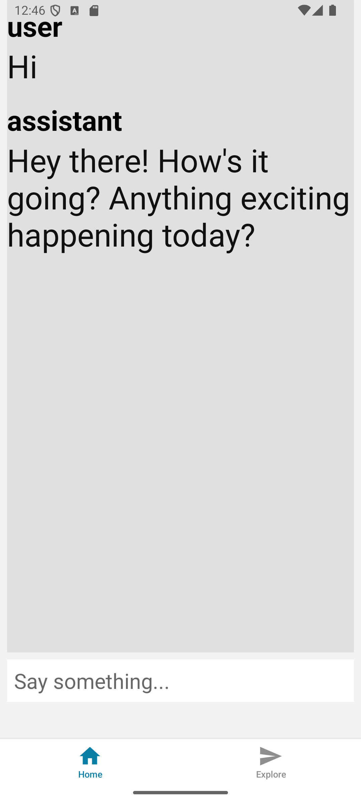

# React Native AI SDK Project:

## A) About:



A mobile app with nest backend to

It uses the following technologies:

- React Native
- AI SDK
- NestJS
- Google Generative AI

## B) How to run Backend:

- Generate an api key from google
- Enable the API to access the Google Genrative AI
- In `/nest-app` create a file called `.env`
- In this file, write the following:

```
GOOGLE_GENERATIVE_AI_API_KEY=""
```

And paste the api key between the `""`.

```bash
cd nest-app/
npm i
npm run start:dev
```

## C) How run the mobile app:

- Make sure that your environment is ready to run expo apps

```bash
cd mobile-app/
npm i
npx expo prebuild --platform android
npm run android
```
